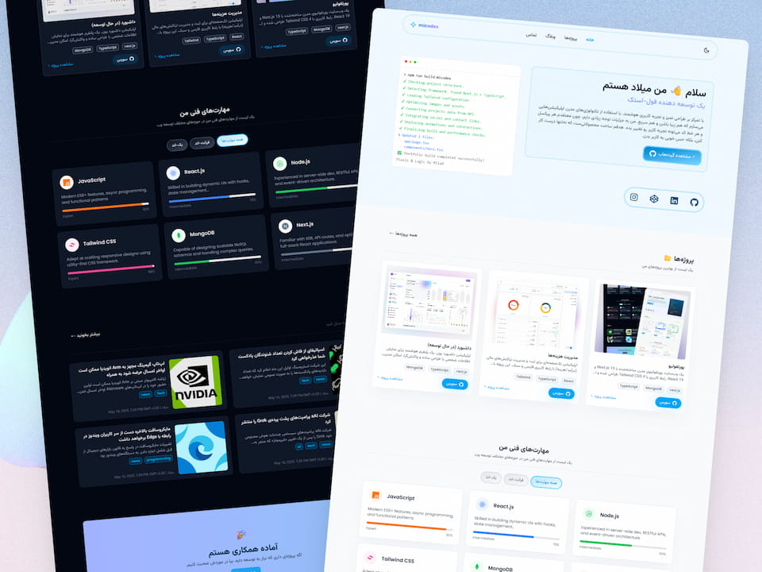

## 🌐 پورتفولیوی micodex

یک وب‌سایت پورتفولیو مدرن ساخته‌شده با **Next.js 15** و **React 19**، شامل صفحات:  
`خانه` • `پروژه‌ها` • `وبلاگ` • `تماس`

رابط کاربری با **Tailwind CSS 4** طراحی شده و از انیمیشن‌های **AOS** و **Framer Motion** برای ترنزیشن‌‌ها استفاده شده است.
داده‌ها از **MongoDB (Mongoose)** خوانده می‌شوند و API سمت سرور برای مدیریت وبلاگ، پروژه‌ها و فرم تماس پیاده‌سازی شده است.

---



### برای دمو اینجا کلیک کنید 👈 [Demo](https://micodex-portfolio.vercel.app/)

## ✨ ویژگی‌ها

🏠 **صفحه اصلی ماژولار**  
 شامل: `HeroSection` • `ProjectSection` (با Suspense و افکت لودینگ) • `SkillSection` • `BlogSection` • `ContactSection`

📝 **وبلاگ با فیلتر و جستجو**  
 امکان فیلتر پست‌ها بر اساس `tag` و جستجو در عنوان/محتوا (`search`).

📂 **فهرست پروژه‌ها**  
 نمایش پروژه‌ها از MongoDB، مرتب‌شده بر اساس تاریخ ایجاد.

📩 **فرم تماس ایمیلی**  
 ارسال پیام‌ها با `nodemailer` (سرویس Gmail) از طریق مسیر API.

🌙 **حالت تیره/روشن**  
 مدیریت تم با `ThemeContext` و ذخیره‌سازی در `localStorage`.

🎞 **انیمیشن‌های نرم**  
 `Framer Motion` برای ترنزیشن‌ها.

🔍 **سئو پایه**  
 تنظیم `metadata` (عنوان، توضیحات، کلیدواژه‌ها و نویسنده) در `app/layout.tsx`.

📱 **رابط کاربری واکنش‌گرا**  
 طراحی مدرن و ریسپانسیو با Tailwind CSS 4.

---

## 🛠️ تکنولوژی‌ها

- **Frontend**: Next.js 15، React 19، TypeScript
- **UI**: Tailwind CSS 4، react-icons
- **Backend**: Mongoose و MongoDB
- **Email**: Nodemailer (Gmail)
- **Animation**: AOS، Framer Motion

---

## 🚀 اسکریپت‌ها

```bash
npm run dev     # اجرای محیط توسعه با Turbopack
npm run build   # ساخت بیلد تولید
npm run start   # اجرای سرور تولید
npm run lint    # اجرای ESLint
```

---

## ⚡راه‌اندازی سریع

1. مخزن را کلون و وابستگی‌ها را نصب کنید:

```bash
git clone <repo-url>
cd next-portfolio
npm install
```

2. متغیرهای محیطی را در فایل `.env.local` تنظیم کنید:

```bash
# MongoDB
MONGODB_URI=mongodb+srv://<user>:<pass>@<cluster>/<db>?retryWrites=true&w=majority

# Email (Gmail)
EMAIL_USER=youremail@gmail.com
EMAIL_PASS=your-app-password
EMAIL_TO=destination@example.com
```

3. اجرای پروژه در حالت توسعه:

```bash
npm run dev
```

سپس به آدرس `http://localhost:3000` مراجعه کنید.

---

## 🔗 API ها

- **GET /api/blog**: دریافت لیست پست‌ها با فیلتر اختیاری

  - پارامترها: `tag=frontend|backend|...`، `search=کلمه`
  - خروجی: `{ success: true, data: Blog[] }`

- **GET /api/projects**: دریافت لیست پروژه‌ها (مرتب شده از جدید به قدیم)

  - خروجی: `{ success: true, data: Project[] }`

- **POST /api/contact**: ارسال پیام تماس با بدنه JSON
  - بدنه: `{ name: string, email: string, message: string }`
  - خروجی موفق: `{ message: "Message sent successfully!" }`

---

### 📂 ساختار پوشه‌ها (خلاصه)

```
app/
  api/
    blog/route.ts         # فیلتر/جستجوی وبلاگ از MongoDB
    projects/route.ts     # فهرست پروژه‌ها از MongoDB
    contact/route.ts      # ارسال ایمیل با Nodemailer
  (صفحات و بخش‌های UI)
components/
  common/, Home/, ui/     # کامپوننت‌های UI و سکشن‌ها
context/ThemeContext.tsx  # مدیریت تم تیره/روشن
lib/mongodb.ts            # اتصال به MongoDB
models/blog.ts, project.ts# مدل‌های Mongoose
styles/, public/, types/  # استایل‌ها، تصاویر و تایپ‌ها
```

---

## 🧑‍💻 نکات توسعه

برای حالت تیره/روشن، کلاس `dark` روی `documentElement` اعمال می‌شود و در `localStorage` ذخیره می‌گردد.

برای ارسال ایمیل با Gmail، از App Password استفاده کنید (نه رمز عبور اصلی).

---

## 📜 مجوز

این پروژه برای استفاده شخصی/نمونه‌کار فراهم شده است. در صورت استفاده مجدد، لطفاً نام سازنده را ذکر کنید.

طراحی و توسعه توسط میلاد غریبی
